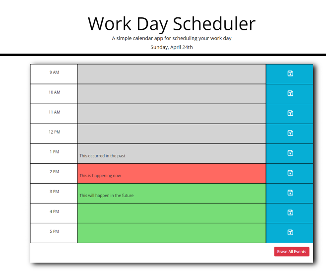
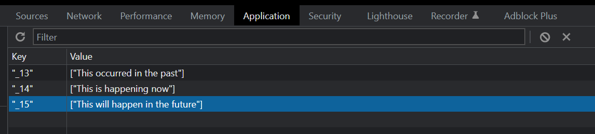

# WorkDayPlanner
## Introduction
WorkDayPlanner is a single-day scoped application with CRUD to localStorage for normal business hours 9AM - 5PM. The application refreshes every 15 minutes to color code the time of day using the user's PC clock. The color coding is: gray=past, red=present, green = future. User is presented with the current date (dynamic) under the title. User may clear all events after that day's events have expired with button. This is an assignment from the UT Austin coding boot camp. 

## Technologies
<li>HTML5
<li>JavaScript 1.7
<li>moment.js 2.24
<li>BootStrap 4.3.1
<li>JQuery 3.4.1
<li>FontAwesome 6.1.1

## Links

<li>Application: https://phaberle.github.io/WORKDAYPLANNER/
<li>Repository : https://github.com/phaberle/WORKDAYPLANNER.git

## Instructions

<ol>
<li>User clicks in a time slot to make text input appear. 
<li>User types in event information.
<li>On mouseleave, user goes to the corresponding white save button on the right and clicks it.
<li>This action produces a dynamic array of the event information. The hour is the name of the array. JSON stringifys the array and it's set into local storage.
</ol>

Upon reloading application, events saved in localStorage are recalled and placed into matching time slots.

